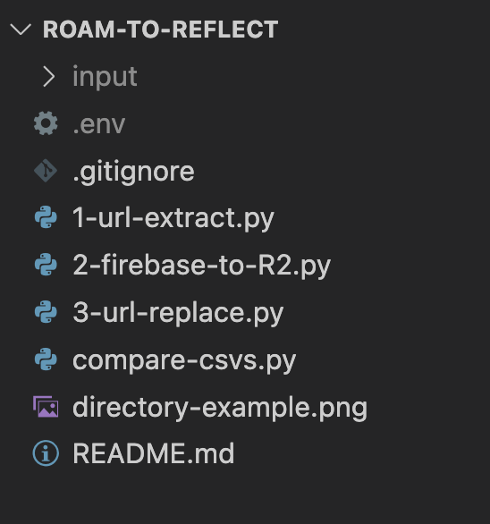

# roam-to-reflect
This code helps you convert the Roam-hosted Firebase URLs in your graphs to self-hosted Cloudflare R2 (using S3 API) URLs. Output is an updated graph JSON file.

## Motivation
Your media is currently stored on Roam's Firebase and displayed through pre-signed URLs. You want to download and host them on your own platform to make sure you don't lose data if Roam deletes the media. For this, you can set up your own cloud storage like Cloudflare R2, but anything else with S3-compatible API will work too. 

## Instructions
1. Add your exported Roam JSON to a folder called "input"
2. Create `.env` file
3. Add the name of the JSON as `INPUT_FILE` to the `.env` file. For example: `INPUT_FILE=Roam.json`.
4. Extract URLs from graph JSON (run `python 1-url-extract.py`)
5. OPTIONAL: If you already imported Roam JSON to Reflect and want to check/apply changes to your Reflect formatted JSON.
    - Download (export) Reflect JSON and apply steps 3-4 to it.
    - Compare Roam and Reflect extracted URLs' CSVs to see the Roam Firebase URLs that failed to import to Reflect (run `python compare-csvs.py`). The outputs are `ums.csv` ("unmatched URLs in smaller csv") and `umb.csv` (unmatched URLs in bigger csv).
    - In my case, the Reflect JSON had 4 pictures that for some reason didn't import from Roam to Reflect. But you might not encounter a problem like that.
    - Decide whether you add the not-imported URLs to your URLs CSV file.
4. Create your files bucket. E.g. Cloudflare R2 because of it's 0 egress fees and up to 10GB free plan storage.
    - Add following variables to the `.env` file:
    - R2_ENDPOINT_URL=https://your-r2-endpoint-url
    - R2_BUCKET_NAME=your-bucket-name
    - R2_ACCESS_KEY_ID=your-access-key-id
    - R2_SECRET_ACCESS_KEY=your-secret-access-key
    - R2_PUBLIC_URL=https://your-public-url
5. Download Firebase files and upload to your cloud storage via S3-compatible API, one by one (run `python 2-firebase-to-R2.py`)
6. Replace all Firebase URLs in the Roam.json or Reflect.json files (run `python 3-url-replace.py`)
7. Import the updated JSON to Reflect. (Possibly in a new graph).

That's it, you now host all your files on your own and can offboard from Roam without fear of losing your personal data.

## Directory
Your directory should look like the following before running any code:

After running the code you should also have an `output` and `downloads` folders. The final files will appear in the `output` folder.
